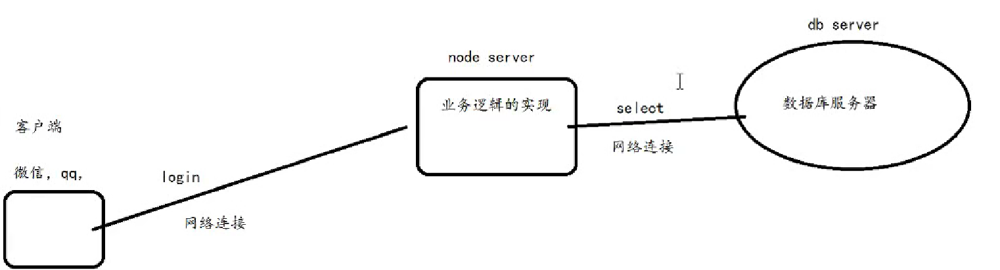
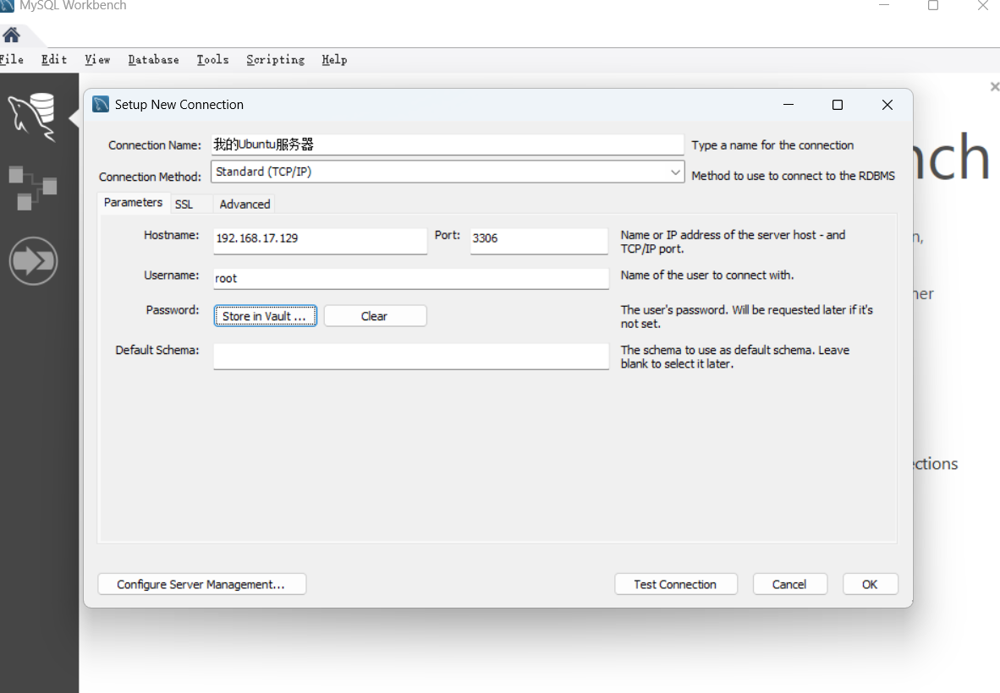
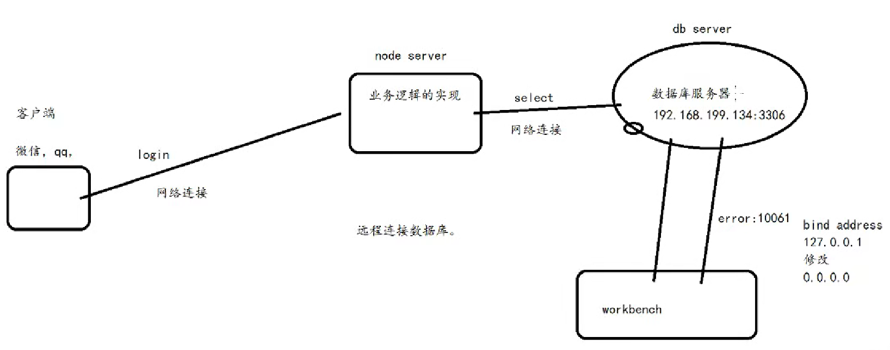

# LinuxC-MySQL数据库

- 数据库服务器：
  - 多个数据库：databases
    - 数据表：table

在开发过程中所处的地位：

数据库服务器一般处于另一台服务器上，

db server：数据库服务器

node server：节点服务器 【业务逻辑的实现】

客户端服务器



# 相关配置

## 支持远程连接服务器

1. 打开MySQL的配置文件并修改`bind-address`：

```bash
sudo nano /etc/mysql/mysql.conf.d/mysqld.cnf
```

`bind-address`：此刻是回环地址`127.0.0.1`，只对内部机器使用，内部进程通信时候使用的，需要改为`0.0.0.0`

2. 重启`MySQL`服务

```bash
sudo systemctl restart mysql		
```

3. 允许任何IP地址访问（**不推荐用于生产环境**）：

```
sudo ufw allow 3306
```

4. 重新加载防火墙规则：

```
sudo ufw reload
```

## 我的首次连接配置信息



通过：

```sql
ALTER USER 'root'@'localhost' IDENTIFIED WITH mysql_native_password BY 'Aa6484594..';
CREATE USER 'root'@'%' IDENTIFIED BY 'Aa6484594..';
GRANT ALL PRIVILEGES ON *.* TO 'root'@'%' WITH GRANT OPTION;
FLUSH PRIVILEGES;
```

设置的`password`：`Aa6484594..`

## 已创建的用户信息

- 首先

- 查看状态：

  ```bash
  sudo systemctl status mysql
  ```

- 以`root`用户登录`MySQL`

```bash
mysql -u root -p
```

- 创建名为`admin`密码为`Aa6484549..`的用户

```mysql
create user 'admin'@'%' identified by '6484594';
```

>- ### `'admin'@'%'`
>
>- `'admin'`：新建用户的用户名叫 **admin**。
>
>- `'@'` 后面的 **`%`**：表示允许该用户从 **任意主机** 远程连接 MySQL。
>
>  - 如果写 `'localhost'`，表示只允许本机登录；
>  - 如果写 `'192.168.1.100'`，表示只允许从该 IP 登录；
>  - `%` 是通配符，表示所有主机都行。
>
>- ### `identified by '6484594'`
>
>  - 指定这个用户的密码是 **6484594**。
>
>  - 之后使用这个用户登录时，命令类似：
>
>    ```
>    mysql -u admin -p -h 服务器IP
>    ```
>
>    然后输入密码 `6484594`。


- 查看所有已经创建的用户和对应的主机限制

  首先切换到`mysql`数据库：`use mysql`

  接着使用

  ```sql
  select Host, User from user;
  ```

  

  ## 为创建的用户分配权限	

  - 比如我们刚才使用`create user 'admin'@'%' identified by 'Aa6484594..';`创建的`admin`用户在`Mysql workbench`中执行`use mysql`命令，提示权限不够，此时需要为他授予权限

- 分配权限步骤：

1. 先使用`root`用户登录：`mysql -uroot -p`
2. 比如让 `admin` 用户能够管理所有数据库中所有表：

```sql
grant all privileges on *.* to 'admin'@'%';
```

3. 之后还需要刷新一下权限：

```sql
flush privileges;
```


# C API上操作MySQL数据库



## 数据库建模

对数据库进行数据存储时候，需要预先进行数据库服务器上面建模，创建相应的数据表格：

也就是**数据库建模**

1. 以`root`用户登录`MySQL`：

2. 先创建数据库：`CREATE DATABASE KING_DB;`

3. 进入该数据库：`USE KING_DB;`

4. 创建数据表：`TBL_USER`

```mysql
CREATE TABLE TBL_USER (
    U_ID INT PRIMARY KEY AUTO_INCREMENT,
    U_NAME VARCHAR(32),
    U_GENDER VARCHAR(8)
);

```

5. 显示：`SHOW TABLES;`

## 编写C代码来操作数据库（上）——MySQL C API 程序编译问题排查解决指南

### 遇到的问题描述：

我目前在`vmvare workstation`中创建的`ubuntu`中安装了`mysql`并完成了一系列基础配置，并创建了用户：`admin`、密码：`Aa6484594..`、该数据库所处虚拟机IP：`192.168.17.129`，能够通过`windows`上的`MySQL WorkBench`远程连接该数据库，并且能够正常执行插入、建表等功能。我想通过编写C代码来远程连接数据库进行相应操作，但是出现了问题：我首先通过在虚拟机中创建share共享文件夹，并通过`samba`与`windows`进行文件共享传输，在`windows`上打开由虚拟机创建的`mysql.c`文件，并输入如下代码后，再在ubuntu执行：
```bash
gcc -o mysql mysql.c -I /usr/include/mysql/ -lmysqlclient提示： "mysql.c:2:9: fatal error: mysql.h: No such file or directory
    2 | #include<mysql.h>
      |         ^~~~~~~~~
```

其中`mysql.c`中代码如下：

```c
#include<stdio.h>
#include<mysql.h>
#include<string.h>
#define KING_DB_SERVER_IP "192.168.17.129"
#define KING_DB_SERVER_PORT 3306
#define KING_DB_USERNAME "admin"
#define KING_DB_PASSWORD "Aa6484594.."
#define KING_DB_DEFAULTDB "KING_DB"

#define SQL_INSERT_TBL_USER "INSERT INTO TBL_USER(U_NAME,U_GENDER)VALUES('King','man');"
int main(){
    MYSQL mysql;
    
    if(NULL == mysql_init(&mysql)){
        printf("mysql_init:%s\n",mysql_error(&mysql));
        return -1;

    }


    if(!mysql_real_connect(&mysql, KING_DB_SERVER_IP, KING_DB_USERNAME, KING_DB_PASSWORD
    ,KING_DB_DEFAULTDB,KING_DB_SERVER_PORT,NULL,0)){
        
        printf("mysql_real_connect:%s\n",mysql_error(&mysql));
        return -2; 
    }

    if(mysql_real_query(&mysql,SQL_INSERT_TBL_USER, strlen(SQL_INSERT_TBL_USER))){
        printf("mysql_real_query:%s\n",mysql_error(&mysql));
    }

    mysql_close(&mysql);
    return 0;
    
}

```

### 解决方案

需要先在 Ubuntu 虚拟机中安装 MySQL 客户端开发库。在终端中执行以下命令：

```bash
sudo apt-get update
sudo apt-get install libmysqlclient-dev
```

`libmysqlclient-dev` 包包含了开发 MySQL C 应用程序所需的头文件和库文件。安装完成后，头文件 `mysql.h` 会被放置在 `/usr/include/mysql/` 目录下。

------


### **重新编译 C 代码**


安装完成后，请在 Ubuntu 虚拟机中再次尝试编译您的 C 代码。 `gcc` 命令基本正确，但为了确保链接到正确的库文件，您可以尝试以下命令：

```bash
gcc -o mysql mysql.c $(mysql_config --cflags) $(mysql_config --libs)
```

>- 在大多数情况下，编译任何基于 `MySQL C API`的程序，都可以使用：
>
>  `gcc -o mysql mysql.c $(mysql_config --cflags) $(mysql_config --libs)`
>
>  - `$(mysql_config --cflags)` 会自动告诉编译器 **mysql.h 的头文件路径**
>
>  - `$(mysql_config --libs)` 会自动告诉链接器 **libmysqlclient 库的位置和依赖库**

接着重新执行可执行C文件

```bash
./mysql
```

### 📌 补充说明

1. **如果程序有多个源文件**
    例如你写了 `main.c` 和 `db_utils.c`，就需要：

   ```bash
   gcc -o myprog main.c db_utils.c $(mysql_config --cflags) $(mysql_config --libs)
   ```

2. **如果要写 Makefile**
    通常会写成：

   ```makefile
   CFLAGS  = $(shell mysql_config --cflags)
   LDFLAGS = $(shell mysql_config --libs)
   
   all: mysql_app
   
   mysql_app: mysql.c
       gcc -o mysql_app mysql.c $(CFLAGS) $(LDFLAGS)
   ```

   这样以后只要 `make` 就能编译。

3. **如果使用 CMake**
    也可以通过 `find_package(MySQL)` 或 `mysql_config` 来配置编译选项。

### 总结

1. **初始化**

   - `mysql_init()` → 像给手机装电池，才能用。
   - 一定要先做，不然没法连接。

2. **连接数据库**

   - `mysql_real_connect()` → 真正拨号上网。
   - 参数顺序：`(对象, IP, 用户, 密码, 数据库, 端口, socket, flag)`

   👉 记口诀：**对，IP、账密、库端口，Sock Flag**。

3. **执行 SQL**

   - `mysql_real_query()` → 执行任何 SQL（增删改查）。
   - 注意 SQL 必须符合语法，字符串要传 `strlen()`。

4. **关闭连接**

   - `mysql_close()` → 断开连接。
   - 必须做，不然资源泄漏。

## 在Node Server上写代码操作DB SERVER

### Mysql数据删除与存储过程调用

```sql
DELIMITER $$
CREATE PROCEDURE PROC_DELETE_USER(IN UNAME VARCHAR(32))
BEGIN
    SET SQL_SAFE_UPDATES=0;
    DELETE FROM TBL_USER WHERE U_NAME = UNAME;
    SET SQL_SAFE_UPDATES=1;
END$$
DELIMITER ;
```

> - 定义一个存储过程 `PROC_DELETE_USER`，
> -  它接受一个用户名 `UNAME`，然后删除 `TBL_USER` 表中对应的用户记录。
> -  为了避免 MySQL 的安全更新限制，它在执行 `DELETE` 前临时关闭 `SQL_SAFE_UPDATES`，删除完成后再恢复。

`DELIMITER $$`：这里把结束符改成 `$$`，告诉 `MySQL`：直到遇到 `$$` 才算整个存储过程结束。


#### 如何定义存储过程

- 模板：

```sql
DELIMITER $$ --把语句结束符从默认的 ; 改成 $$，避免和过程体里面的 ; 冲突。

CREATE PROCEDURE 存储过程名(参数列表)
BEGIN
    -- 过程体（可以写多条 SQL 语句）
END$$

DELIMITER ;
```

>1. 参数列表中参数类型有三种;
>
>(`IN` 参数名 数据类型)      -- 输入参数，调用时传入
>(`OUT` 参数名 数据类型)     -- 输出参数，调用后返回结果
>(`INOUT` 参数名 数据类型)   -- 输入 + 输出
>
>2. 可以有参数，也可以无参数，比如你在过程体中定义执行一条查询语句`SELECT`


#### 如何使用C-MySQL API来调用存储过程

在MySQL中执行定义该存储过程语句：

```mysql
DELIMITER $$
CREATE PROCEDURE PROC_DELETE_USER(IN UNAME VARCHAR(32))
BEGIN
SET SQL_SAFE_UPDATES=0;
DELETE FROM TBL_USER WHERE U_NAME=UNAME;
SET SQL_SAFE_UPDATES=1;
END$$
```

然后在C中通过这种方式来调用：	

```mysql
#define SQL_DELETE_TBL_USER "CALL PROC_DELETE_USER('test')"
mysql_real_query(&mysql,SQL_DELETE_TBL_USER, strlen(SQL_DELETE_TBL_USER))
```


### 图片存储 read image

如何实现将图片存储到MySQL数据库服务器中、如何从数据库中读取一张图片出来

1. 准备好一张图片，并且将图片read

2. xxx mysql_write
3. 把数据库中图片读取出来:mysql_read_image
4. 写入磁盘


把文件写入到数据库过程：

1. 读取文件到内存（Buffer）
2. 将数据发送到数据库
3. 数据库存储数据

把文件从数据库中读取过程：

1. **从数据库中查询数据**
2. 数据库发送数据到应用服务器
3. 将数据写入到文件或直接响应
   - 写入新文件
   - 直接响应


### 图片存储 mysql_write

修改表结构，新增显示图片列：

`ALTER TABLE TBL_USER ADD U_IMG BLOB`


`STATEMENT`


`MYSQL_BIND`：对于输入，它与`mysql_stmt_bind_param()`一起使用，用参数数据值绑定到缓冲区上，以供`mysql_stmt_execute()`使用；对于输出，它与`mysql_stmt_bind_result()`一起使用，用于绑定结果缓冲区，以`with mysql_stmt_fetch()`以获取行


#### 主要API

`mysql_stmt_prepare()`:

- **作用**：将带有 `?` 占位符的 SQL 语句发送给 MySQL 服务器进行**编译**。

`mysql_stmt_bind_param()`:

- **作用**：将你即将发送的数据类型和缓冲区与 SQL 语句中的占位符 (`?`) 绑定。

`mysql_stmt_send_long_data()`:

- **作用**：用于分块发送大型 `BLOB` 数据，避免一次性将所有数据加载到内存中

`mysql_stmt_execute()`:

- **作用**：执行已经准备好的 SQL 语句。

`mysql_stmt_close()`:

- **作用**：关闭语句句柄并释放相关资源。

`mysql_stmt_bind_result()`：

- **作用**：将查询结果的列与你的 C 变量绑定。

`mysql_stmt_fetch()`：

- **作用**：从结果集中获取下一行数据，并将其存入到通过 `mysql_stmt_bind_result()` 绑定的缓冲区中


```C
#include<stdio.h>        // 标准输入输出库，用于 printf、fopen 等函数
#include<mysql.h>        // MySQL C API 头文件，提供 MySQL 相关操作的函数和结构体
#include<string.h>       // 字符串处理函数库，如 strlen、memset 等

// 数据库连接配置（IP、端口、用户名、密码、默认数据库）
#define KING_DB_SERVER_IP "192.168.17.129"
#define KING_DB_SERVER_PORT 3306
#define KING_DB_USERNAME "admin"
#define KING_DB_PASSWORD "Aa6484594.."
#define KING_DB_DEFAULTDB "KING_DB"

// SQL 语句常量定义
#define SQL_INSERT_TBL_USER "INSERT INTO TBL_USER(U_NAME,U_GENDER)VALUES('test','MAN');"
#define SQL_SELECT_TBL_USER "SELECT * FROM TBL_USER;"   // 查询语句
#define SQL_DELETE_TBL_USER "CALL PROC_DELETE_USER('test')" // 调用存储过程删除用户
#define SQL_INSERT_IMG_USER "INSERT INTO TBL_USER(U_NAME,U_GENDER,U_IMG)VALUES('picname','MAN',?);" // 插入图片（参数 ? 用于绑定 BLOB）
#define SQL_SELECT_IMG_USER "SELECT U_IMG FROM TBL_USER WHERE U_NAME='picname';"                     // 查询图片

#define FILE_IMAGE_LENGTH 64*1024   // 缓冲区大小：64KB（存放图片数据）

//-------------------------------------------
// 功能函数：执行 SELECT 语句并打印结果
//-------------------------------------------
int king_mysql_select(MYSQL *handle){
    // 执行 SQL 查询（发送 SQL 语句给 MySQL 服务器）
    if(mysql_real_query(handle,SQL_SELECT_TBL_USER, strlen(SQL_SELECT_TBL_USER))){
        printf("mysql_real_query:%s\n",mysql_error(handle));
        return -1;
    }

    // 获取查询结果集（结果存储到客户端内存中）
    MYSQL_RES *res = mysql_store_result(handle);
    if(res == NULL){
        printf("mysql_store_result:%s\n",mysql_error(handle));
        return -2;
    }

    // 获取行数
    int rows = mysql_num_rows(res);
    printf("rows:%d\n",rows);
    
    // 获取列数
    int fields = mysql_num_fields(res);
    printf("fields: %d\n",rows);  // 注意：这里打印了 rows，本应打印 fields

    // 遍历结果集，逐行逐列输出
    MYSQL_ROW row;
    while((row = mysql_fetch_row(res))){
        int i = 0;
        for(i = 0 ; i < fields;i++){
            printf("%s\t",row[i]);  // 打印每一列的值
        }
        printf("\n");
    }

    mysql_free_result(res);  // 释放结果集内存
    return 0;
}

//-------------------------------------------
// 从磁盘读取图片文件到内存 buffer
//-------------------------------------------
int read_image(char *filename,char *buffer){
    if(filename == NULL || buffer == NULL)return -1;

    FILE *fp = fopen(filename,"rb");  // 以二进制读模式打开文件
    if(fp == NULL){
        printf("fopen failed\n");
        return -2;
    }

    // 获取文件大小
    fseek(fp,0,SEEK_END);        // 移动到文件末尾
    int length = ftell(fp);      // 获取当前位置（文件大小）
    fseek(fp,0,SEEK_SET);        // 再移动回文件开头

    // 读取文件内容到 buffer
    int size = fread(buffer,1,length,fp);
    if(size != length){
        printf("fread failed:%d\n",size);
        return -3;
    }
    fclose(fp);
    return size;   // 返回文件大小
}

//-------------------------------------------
// 把内存中的图片数据写到磁盘文件
//-------------------------------------------
int write_image(char *filename,char *buffer,int length){
    if(filename == NULL || buffer == NULL || length <= 0)return -1;
    FILE *fp = fopen(filename,"wb+");   // 二进制写模式
    if(fp == NULL){
        printf("fopen failed\n");
        return -2;
    }

    int size = fwrite(buffer,1,length,fp); // 写入文件
    if(size != length){
        printf("fwrite failed: %d\n",size);
        return -3;
    }
    
    fclose(fp);
    return size;
}

//-------------------------------------------
// 向数据库写入图片（二进制大对象 BLOB）
//-------------------------------------------
int mysql_write(MYSQL *handle,char *buffer, int length){
    if(handle == NULL || buffer == NULL || length <=0)return -1;

    MYSQL_STMT *stmt = mysql_stmt_init(handle); // 初始化语句对象
    int ret = mysql_stmt_prepare(stmt,SQL_INSERT_IMG_USER,strlen(SQL_INSERT_IMG_USER)); // 预处理 SQL
    if(ret){
        printf("mysql_stmt_prepare : %s\n",mysql_error(handle));
        return -1;
    }

    // 绑定参数（?）
    MYSQL_BIND param = {0};
    param.buffer_type  = MYSQL_TYPE_LONG_BLOB;  // 参数类型：长 BLOB
    param.buffer = NULL;                        // 数据不直接通过 buffer 传输
    param.is_null = 0;                          // 参数不为 NULL
    param.length = NULL;                        // 长度由 send_long_data 指定

    ret = mysql_stmt_bind_param(stmt, &param);  // 绑定参数
    if (ret) {
        printf("mysql_stmt_bind_param : %s\n", mysql_error(handle));
        return -3;
    }
    
    // 分块发送 BLOB 数据（这里只有一次性发送）
    ret = mysql_stmt_send_long_data(stmt,0,buffer,length);
    if(ret){
        printf("mysql_stmt_send_long_data : %s\n", mysql_error(handle));
        return -4;
    }
    
    // 执行语句
    ret = mysql_stmt_execute(stmt);
    if(ret){
        printf("mysql_stmt_execute : %s\n", mysql_error(handle));
        return -5;
    }

    // 关闭语句句柄
    ret = mysql_stmt_close(stmt);
    if(ret){
        printf("mysql_stmt_close : %s\n", mysql_error(handle));
        return -6;
    }

    return ret;
}

//-------------------------------------------
// 从数据库读取图片（二进制大对象 BLOB）
//-------------------------------------------
int mysql_read(MYSQL *handle,char *buffer,int length){
    if(handle == NULL || buffer == NULL || length <=0)return -1;

    MYSQL_STMT *stmt = mysql_stmt_init(handle); // 初始化语句
    int ret = mysql_stmt_prepare(stmt,SQL_SELECT_IMG_USER,strlen(SQL_SELECT_IMG_USER)); // 预处理查询
    if(ret){
        printf("mysql_stmt_prepare1 : %s\n",mysql_error(handle));
        return -1;
    }

    MYSQL_BIND result = {0};
    result.buffer_type  = MYSQL_TYPE_LONG_BLOB; // 返回类型：长 BLOB
    unsigned long total_length = 0;             // 存储总长度
    result.length = &total_length;              // 把总长度地址传给 MySQL

    ret = mysql_stmt_bind_result(stmt,&result); // 绑定结果集
    if(ret){
        printf("mysql_stmt_bind_result : %s\n",mysql_error(handle));
        return -3;
    }

    ret= mysql_stmt_execute(stmt);  // 执行查询
    if(ret){
        printf("mysql_stmt_execute : %s\n",mysql_error(handle));
        return -4;
    }

    ret = mysql_stmt_store_result(stmt); // 存储结果集到客户端
    if(ret){
        printf("mysql_stmt_store_result: %s\n",mysql_error(handle));
        return -5;
    }

    // 循环获取 BLOB 数据
    while(1){
        ret = mysql_stmt_fetch(stmt);  // 获取一行
        if(ret != 0 && ret != MYSQL_DATA_TRUNCATED){
            break; // 没有更多数据
        }
        
        int start = 0;
        // 分块读取 BLOB 内容
        while (start < (int)total_length) {
            result.buffer = buffer + start;   // 指定写入 buffer 的位置
            result.buffer_length = 1;         // 每次只取 1 字节
            mysql_stmt_fetch_column(stmt, &result, 0, start);
            start += result.buffer_length;
        } 
    }

    mysql_stmt_close(stmt);  // 关闭语句
    return total_length;     // 返回读取的字节数
}

//-------------------------------------------
// 主函数：程序入口
//-------------------------------------------
int main(){
    MYSQL mysql;  // MySQL 连接句柄
    
    // 初始化 MySQL 句柄
    if(NULL == mysql_init(&mysql)){
        printf("mysql_init:%s\n",mysql_error(&mysql));
        return -1;
    }

    // 建立连接
    if(!mysql_real_connect(&mysql, KING_DB_SERVER_IP, KING_DB_USERNAME, KING_DB_PASSWORD,
                           KING_DB_DEFAULTDB,KING_DB_SERVER_PORT,NULL,0)){
        printf("mysql_real_connect:%s\n",mysql_error(&mysql));
        goto Exit;
    }

    // 初始查询
    king_mysql_select(&mysql);

    // 执行插入
    printf("case: mysql --> insert \n");
#if 1
    if(mysql_real_query(&mysql,SQL_INSERT_TBL_USER, strlen(SQL_INSERT_TBL_USER))){
        printf("mysql_real_query1:%s\n",mysql_error(&mysql));
        goto Exit;
    }
#endif

    // 插入后再次查询
    king_mysql_select(&mysql);

    // 执行存储过程删除
    printf("case: mysql --> delete \n");
#if 1
    if(mysql_real_query(&mysql,SQL_DELETE_TBL_USER, strlen(SQL_DELETE_TBL_USER))){
        printf("mysql_real_query2:%s\n",mysql_error(&mysql));
        goto Exit;
    }
#endif

    // 删除后再次查询
    king_mysql_select(&mysql);

    // 插入并读取图片测试
    printf("case: mysql--->read image and write mysql\n");
    char buffer[FILE_IMAGE_LENGTH]= {0};
    int length = read_image("/home/leoking/share/MySQL/test.png",buffer); // 读取本地文件
    if(length < 0)goto Exit;

    mysql_write(&mysql,buffer,length); // 写入数据库

    printf("case: mysql--->read mysql and write image\n");
    memset(buffer ,0 ,FILE_IMAGE_LENGTH);
    length = mysql_read(&mysql,buffer,FILE_IMAGE_LENGTH); // 从数据库读取图片

    write_image("readout.png",buffer,length); // 写到磁盘

Exit:
    mysql_close(&mysql);  // 关闭连接
    return 0;
}

```


作业题：

若node server有很多与数据库服务器连接，如何一次性初始化多个handle，实现数据库连接池？
