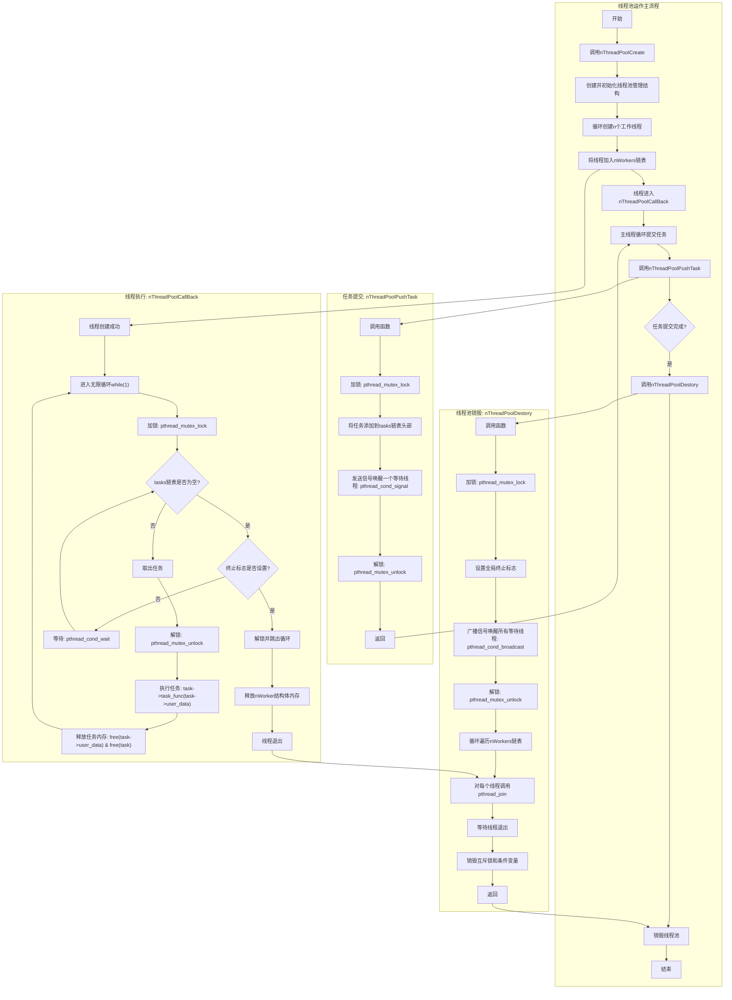

```mermaid
graph TD
    %% 主流程
    subgraph A["线程池运作主流程"]
        A1["开始"] --> A2["调用nThreadPoolCreate"]
        A2 --> A3["创建并初始化线程池管理结构"]
        A3 --> A4["循环创建n个工作线程"]
        A4 --> A5["将线程加入nWorkers链表"]
        A5 --> A6["线程进入nThreadPoolCallBack"]
        A6 --> A7["主线程循环提交任务"]
        A7 --> A8["调用nThreadPoolPushTask"]
        A8 --> A9{"任务提交完成?"}
        A9 -- "是" --> A10["调用nThreadPoolDestory"]
        A10 --> A11["销毁线程池"]
        A11 --> A12["结束"]
    end

    %% 任务提交流程
    subgraph B["任务提交: nThreadPoolPushTask"]
        B1["调用函数"] --> B2["加锁: pthread_mutex_lock"]
        B2 --> B3["将任务添加到tasks链表头部"]
        B3 --> B4["发送信号唤醒一个等待线程: pthread_cond_signal"]
        B4 --> B5["解锁: pthread_mutex_unlock"]
        B5 --> B6["返回"]
    end

    %% 线程回调流程
    subgraph C["线程执行: nThreadPoolCallBack"]
        C1["线程创建成功"] --> C2["进入无限循环while(1)"]
        C2 --> C3["加锁: pthread_mutex_lock"]
        C3 --> C4{"tasks链表是否为空?"}
        C4 -- "是" --> C5{"终止标志是否设置?"}
        C5 -- "是" --> C6["解锁并跳出循环"]
        C5 -- "否" --> C7["等待: pthread_cond_wait"]
        C7 --> C4
        C4 -- "否" --> C8["取出任务"]
        C8 --> C9["解锁: pthread_mutex_unlock"]
        C9 --> C10["执行任务: task->task_func(task->user_data)"]
        C10 --> C11["释放任务内存: free(task->user_data) & free(task)"]
        C11 --> C2
        C6 --> C12["释放nWorker结构体内存"]
        C12 --> C13["线程退出"]
    end

    %% 线程池销毁流程
    subgraph D["线程池销毁: nThreadPoolDestory"]
        D1["调用函数"] --> D2["加锁: pthread_mutex_lock"]
        D2 --> D3["设置全局终止标志"]
        D3 --> D4["广播信号唤醒所有等待线程: pthread_cond_broadcast"]
        D4 --> D5["解锁: pthread_mutex_unlock"]
        D5 --> D6["循环遍历nWorkers链表"]
        D6 --> D7["对每个线程调用pthread_join"]
        D7 --> D8["等待线程退出"]
        D8 --> D9["销毁互斥锁和条件变量"]
        D9 --> D10["返回"]
    end

    %% 流程连接
    A8 --> B1
    B6 --> A7
    A5 --> C1
    A10 --> D1
    C13 --> D7
    D10 --> A11
```

