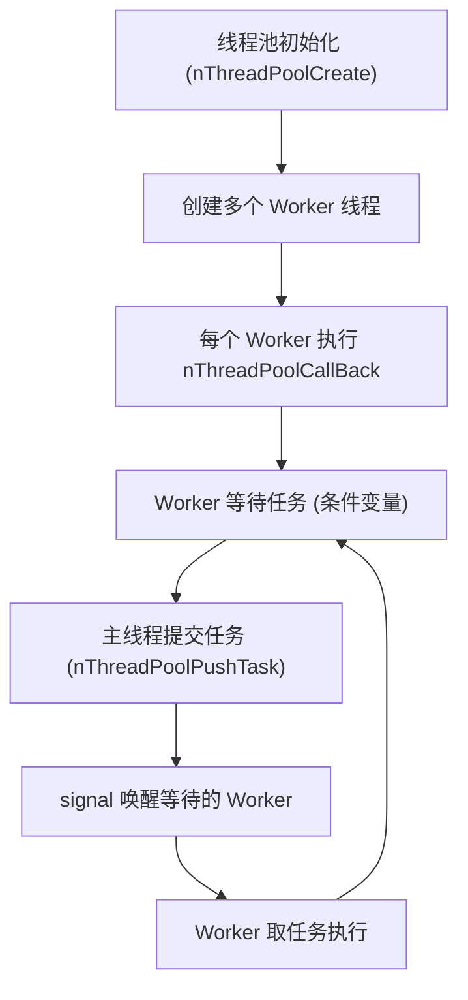
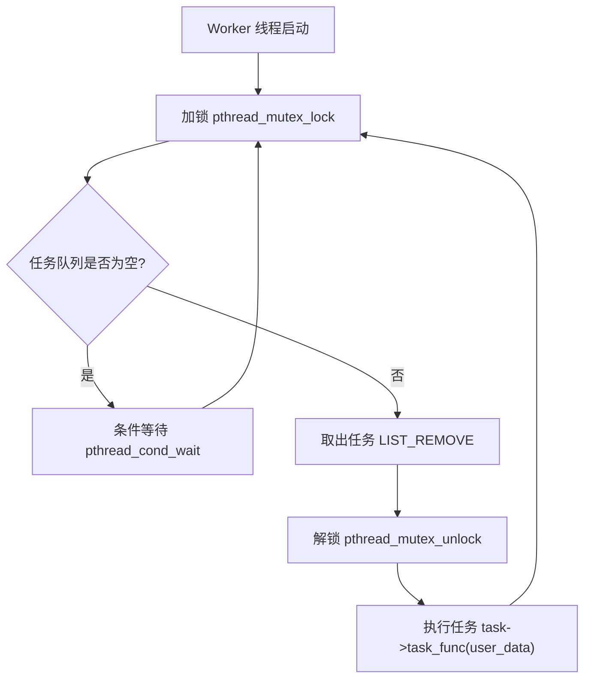
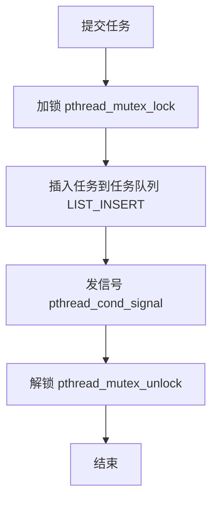
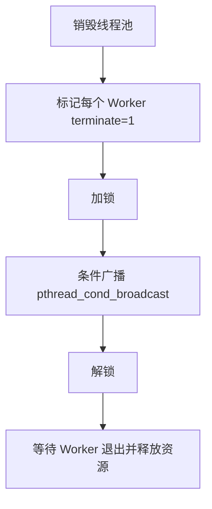

# 完整交互图

````mermaid
sequenceDiagram
    participant Main as 主线程
    participant Pool as 线程池
    participant Worker as Worker线程

    Main->>Pool: nThreadPoolCreate()
    Pool->>Worker: 创建并启动线程 nThreadPoolCallBack
    Worker->>Worker: pthread_cond_wait() 等待任务

    Main->>Pool: nThreadPoolPushTask(task)
    Pool->>Pool: 加锁 + 插入任务队列
    Pool->>Worker: pthread_cond_signal 唤醒 Worker

    Worker->>Pool: 取任务 LIST_REMOVE
    Worker->>Worker: 解锁
    Worker->>Worker: 执行 task_func(user_data)
    Worker->>Worker: 再次等待任务

````


# 整体概览



###  **Worker 线程的执行逻辑 (nThreadPoolCallBack)**




## 提交任务 (nThreadPoolPushTask) 的逻辑





## 线程池销毁 (nThreadPoolDestroy) 的逻辑



